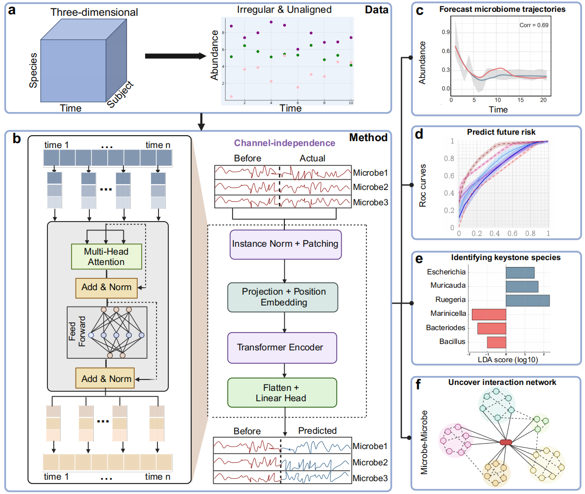

# MicroProphet
MicroProphet is a transformer-based digital twin model for microbial time-series prediction, designed to accurately forecast microbial dynamics without requiring data alignment or imputation, making it suitable for diverse and irregular microbiome datasets.



# Installation

Install MicroProphet using pip:

```bash
pip install MicroProphet
```

Or you can download the offline installation package from the GitHub release page and install MicroProphet using the following command:
```bash
pip install micro_prophet-0.1.0-py3-none-any.whl
```

MicroProphet is developed under the environment of Python3, and uses Pytorch to build the model. GPU devices are recommended to accelerate model inference.

# Usage

## MicroProphet Pipline


## Download models

# Maintainer

| Name | Email | Organization |
|-------|-------|-------|
| Yuli Zhang | yulizhang@hust.edu.cn | PhD student, School of Life Science and Technology, Huazhong University of Science & Technology |
| Kouyi Zhou | zhoukouyi@hust.edu.cn | PhD student, School of Life Science and Technology, Huazhong University of Science & Technology |
| Kang Ning  | ningkang@hust.edu.cn | Professor, School of Life Science and Technology, Huazhong University of Science & Technology|
